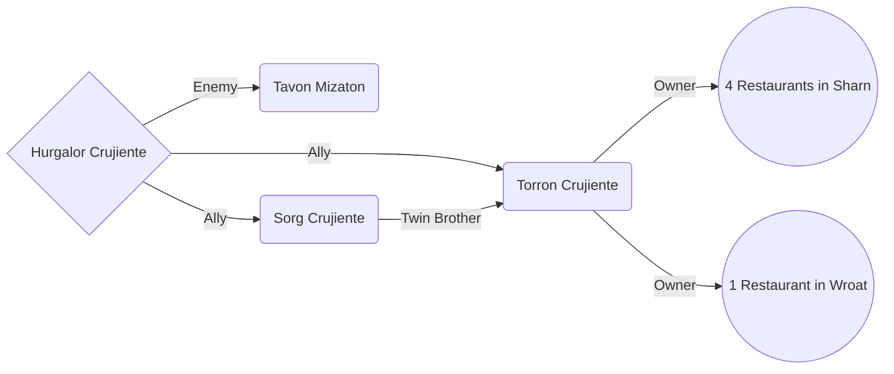

# Hurgalor Crujiente
- Race: Dwarf
- Class: Oath Paladin

## Background

The Crujiente family gained their wealth by perfecting the joy of chicken consumption. They perfected the flavor and crunch of biting into a piece of chicken. Not only did they perfect the taste of chicken, but they revolutionized the way people ate. Great, great, grand matriarch Norgette Crujiente was able to compress chicken into handheld forms and sold them from the very first Crujiente restaurant, "Norgette's". Eventually the compressed chicken had become synonymous with her name and were known as "norgettes". Her empire expanded at an astronomical rate and soon after, imposters started to appear. People had started to call them "nuggettes" in order to sneak past trademarks, but soon the Crujiente family was able to take the name, and all forms of compressed chicken known as nuggettes become associated with the Crujiente family.

Hurgalor was the youngest of this generations Crujientes and was known for his temper. Used to always getting what he wants, and never taking no for an answer, he always expects the best treatment wherever he goes and always demands to speak with the manager first, in order to make sure everything goes his way. However, not everyone was keen with that, and Hurgalor went over the top. In order to keep the honor of the Crujiente name, his parents sent him to a rehabilitation center to help him control his anger.

While in rehabilitation, Hurgalor found that the people did not give him the respect that he deserved (or so he though he deserved). He saw that the clerics of the church held the people's respect and needed that respect for himself as well. Hurgalor devoted himself to the clergy and was soon a well respected cleric within the town of Ringbriar. Soon people knew him more for his deeds than his name, and Hurgalor liked that.

Due to his newfound position, Hurgalor now feels almost as entitled as he has before, but now for a different reason. He only does good deeds so that he can feel respected. He is back to his old ways, but at least now, he performs good deeds and upholds the law.

## Sharn Relations

