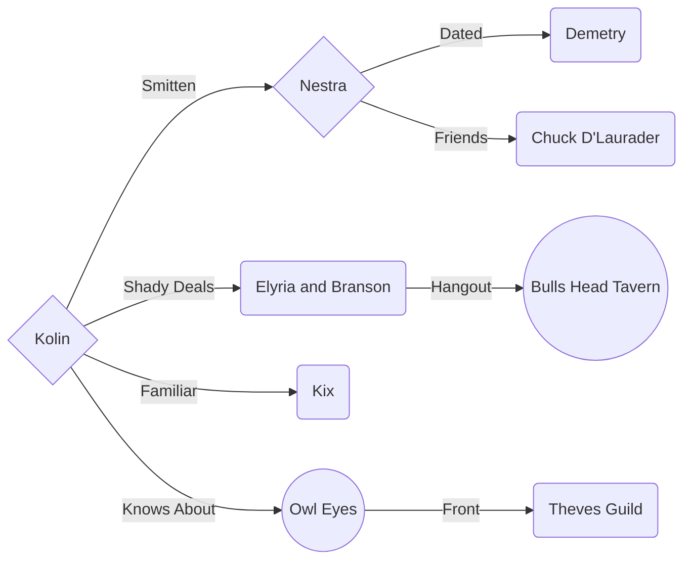
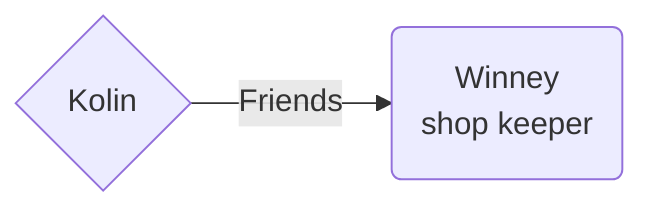

# Kotlin the Recursive

The rougeist rogue ever.

> :collision: Max Damage Output: **71** 4/5/2022

:boy: Race: **High Elf**

:scroll: Class: **Arcane Trickser Rogue**

:shield: Level: **5**

## Background

_im working on it i promise_

## Sharn Relations

## Zilspare Relations

## Stats

- [D&D Beyond Character Sheet](https://www.dndbeyond.com/characters/65138916)
