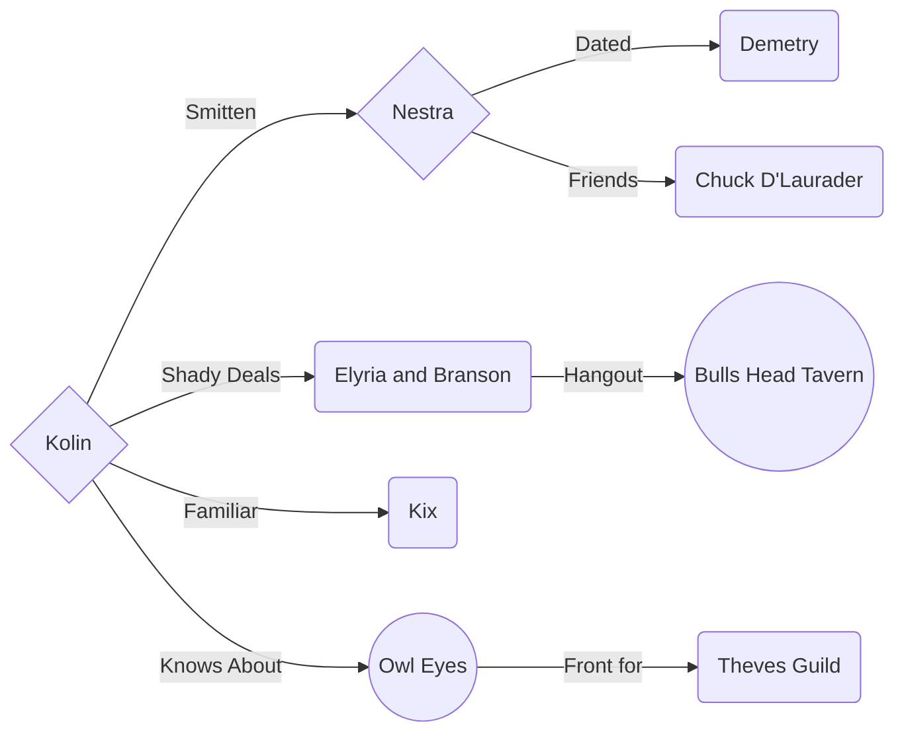
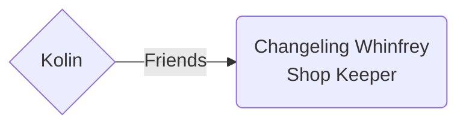

# Kotlin the Recursive
Race: High Elf

Class: Arcane Trickser Rogue

Stats: [D&D Beyond Character Sheet](https://www.dndbeyond.com/characters/65138916)

## Achievements

> :collision: Max Damage Output: **71** 4/5/2022

## Background

The rougeist rogue ever.

_im working on it i promise_

## Sharn Relations

## Zilspare Relations

