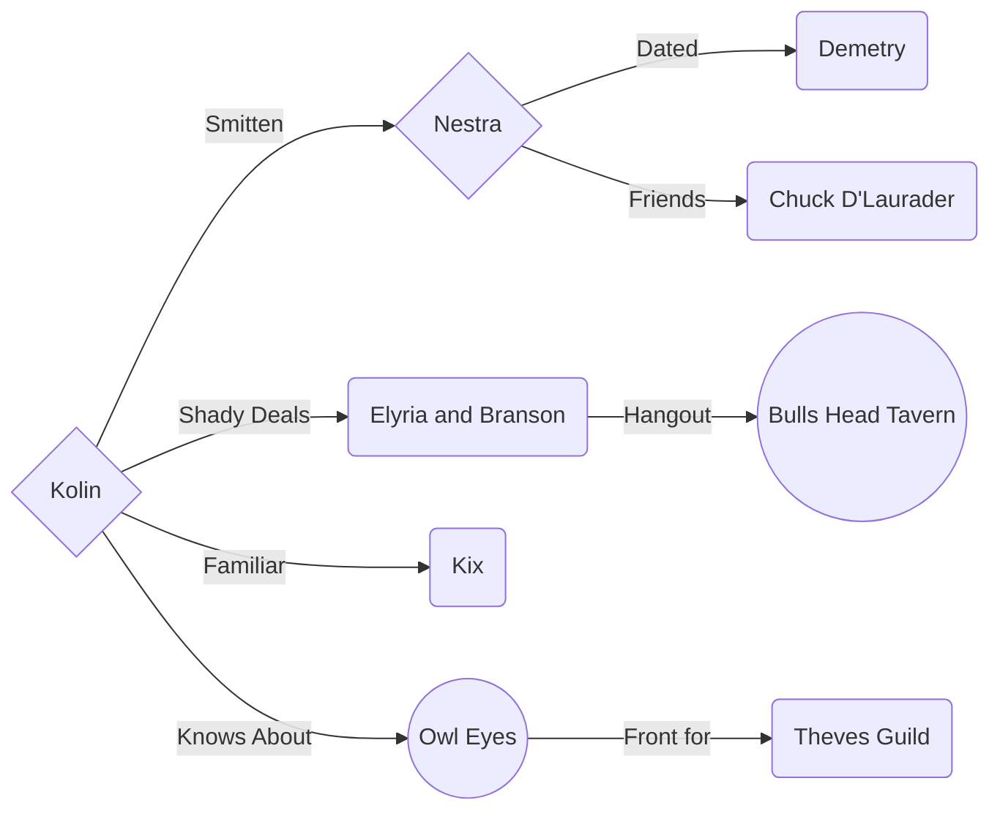
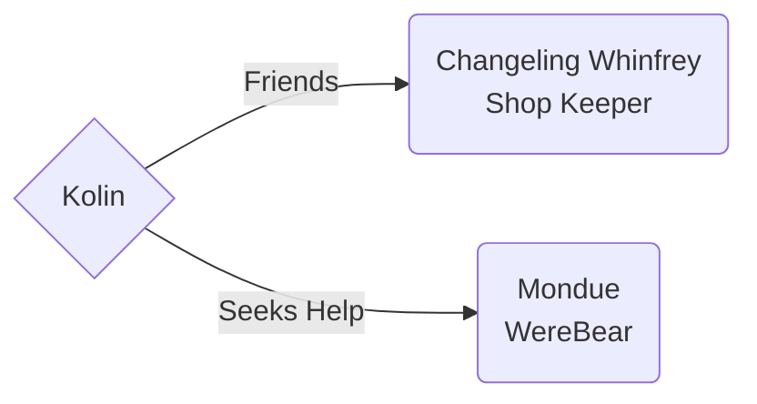

# Kotlin the Recursive

#### Biography

Race: High Elf

Class: Arcane Trickser Rogue

Age: 107

Height: 7' 2"

#### Achievements

Max Damage Output: **71** 4/5/2022

#### Stats

<a href="https://www.dndbeyond.com/characters/65138916" target="_blank">D&D Beyond Character Sheet</a>

## Background

Kotlin was born about the time the great war began.  

Both of Kotlin's parents where powerful high ranking [Sun Elves](https://forgottenrealms.fandom.com/wiki/Sun_elf) with a lineage that could be traced back thousands of years.

However, a strange curse befell Kotlin erasing any memory of his family or past life.

Time, as far as Kotlin knows, began on his journey to Ringbriar where he met Dane Fireforge in a tavern close to the sliver flame chapel. 

As time continued Kotlin found a strange attraction to magic and would often have dreams of his mysterious past life.

He however considers them part of the [elvin reverie](https://forgottenrealms.fandom.com/wiki/Reverie) where he relives vivid battles and fantastic conflicts. 

With little understanding of his past, but inspired by visions, Kotlin quickly gained a reputation as a local folk hero often spinning wild tales so realistic anyone hearing him had no reason to doubt him.

Kotlin has flashes of brilliance, but often is more interested in seeking new experiences even if it means placing himself in danger.

This has opened doors for Kotlin in the theves guilds where is able to explore new challenges from behind a cloke and dagger.

Still, without knowledge of his family or real past, Kotlin clings to those like Dane who he befreinds and finds trustworthy.

So much so that Dane knows some great secret of Kotlins

## Sharn Relations

## Zilspare Relations

