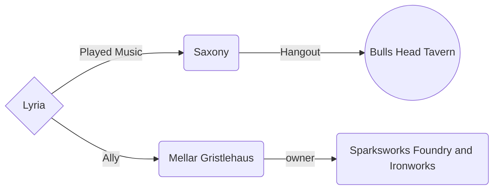
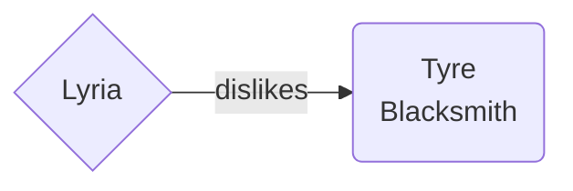

# Lyria Bardini

Race: Half Elf 

Class: Bard of the College of Creation

## Background

I updated my backstory a tiny bit. It's still mostly the same with a few tweaks...

Lyria grew up surrounded by artists in the City of Lights, Fairhaven. Her elven mother Raenisa, was a famous singer in her home country and still performs at the Grand Aundairian Opera House in Fairhaven. Her father Yen, a Khoravar painter, encouraged all his children to follow their dreams. She is the youngest of 5 children: 3 older brothers (Ori, Wilion & Dovah) and an older sister (Ophelya).

When Lyria was 16 she left home to follow in her mother's footsteps, make a name for herself and seek adventure. Lyria started a band, The Ravenettes, with her childhood friend Siouxie Balliadon. The band became a tight-knit family, traveling together for many years and performing at various small taverns throughout the land always looking for their big break.

Their big break came 4 years ago, when The Ravenettes got the gig of a lifetime. The band was meant to perform in the city of Metrol at the royal court. Everyone was excited but before they left, Lyria and Kurt Gnomebain, a fellow performer, got into an argument that resulted in Lyria leaving the band. Her childhood friend, Siouxie, gifted her a small trinket of a mechanical sparrow inside a gnomish lamp to remind her that she could always comeback to The Ravenettes. She said her goodbyes, wished them luck and stayed in Ringbriar.

Lyria heard of what happened during The Mourning. She decided to stay in Ringbriar in the hopes that Siouxie would meet her there, but no one ever came. She has been making a living performing and working at Torbald's Firebreath Tavern.
One day, while tending the bar she met an unpleasant fellow who said to her "if I may..." and demanded to speak with the manager after refusing to pay for an ale he deemed unsuitable. Upset by this character's entitlement, Lyria decided she would follow him around until he paid. While following him around Lyria ends up joining a group of adventurers. Will the promise of gold be the reward to this quest or will it be the friends she makes along the way.

## Sharn Relations

## Zilspar Relations

