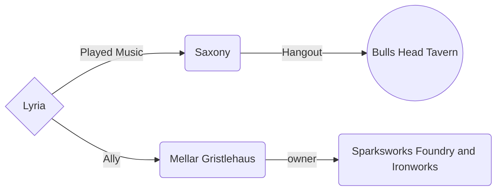
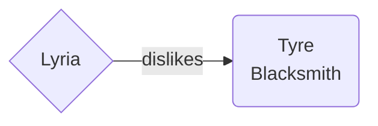

# Background

Lyria grew up surrounded by artists and creative types. Her elven mother was a famous singer in her home country. Her father was a painter and encouraged all his children to follow their passions. She is the youngest of 5 children: 3 older brothers and an older sister. When Lyria was 16 she left home to follow in her mother's footsteps, make a name for herself and seek adventure. Lyria joined a troupe, The Troubadours, whom she traveled with for many years performing on the road, inns, taverns, private events and even at small courts throughout the land. They formed a tight-knit family, always looking out for their big break.

Their big break came 4 years ago, when they got the gig The Troubadours had been waiting for. The troupe was meant to perform in the city of Metrol at the royal court. Everyone was excited but right before they were meant to leave, Lyria and Cicero, a fellow performer, got into an argument that resulted in Lyria leaving the troupe. Her friend and mentor, Tom Pettyus, gifted her a small trinket of a mechanical canary inside a gnomish lamp to remind her that she would always have a place to comeback to with the Troubadours despite what happened. She said her goodbyes and stayed in Ringbriar.

Lyria later heard of what happened at the Mourning. She hoped her troupe family made it out safely and decided to stay in Ringbriar in the hopes that maybe her troupe family would meet her there, but no one ever came. She's been making a living performing and working the bar at Torbald's Firebreath Tavern.

One day, while tending the bar she met an unpleasant fellow who said to her "if I may..." and demanded to speak with the manager after refusing to pay for an ale they deemed unsuitable. Upset by this character's entitlement, Lyria decided she would follow him around until he paid. While following him around Lyria ends up joining a group of adventurers. Will the promise of gold be the reward to this quest or will it be the friends she makes along the way.

## Sharn Relations

## Zilspar Relations

