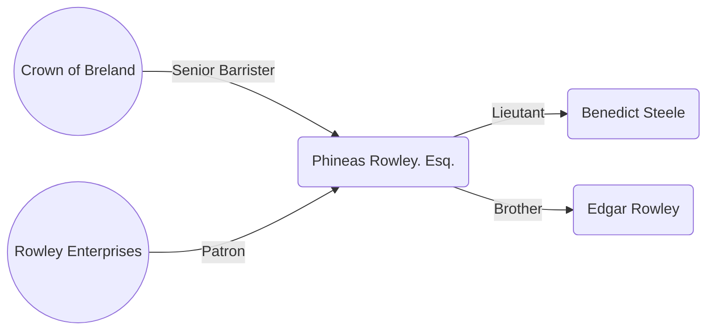
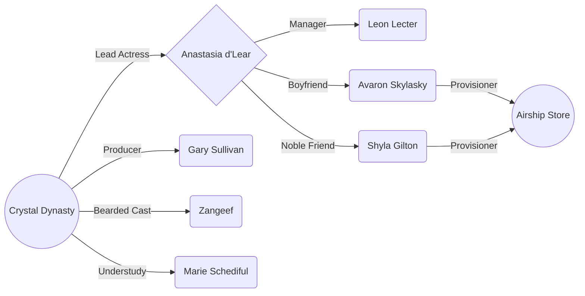
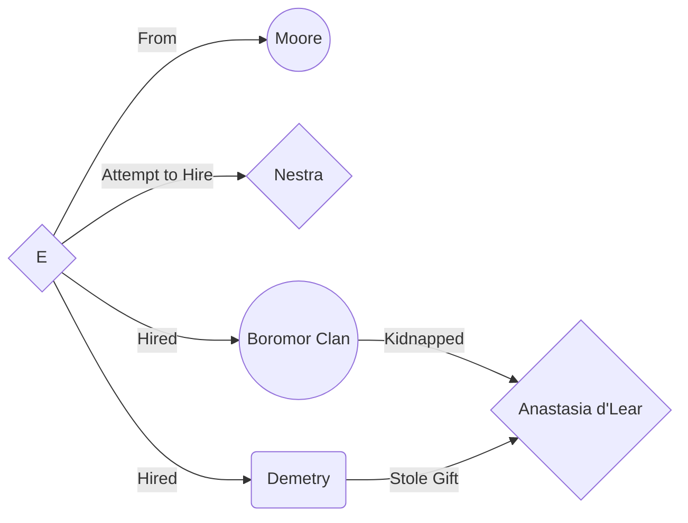

# Sharn

Sharn is the most populous city in all of Khorvaire, and arguably all of Eberron. The city literally towers atop a cliff above the mouth of the Dagger River in southern Breland. Sharn is known as the City of Towers, but has also been called many other names, including the City of Knives, the City of Lost Souls, the City of a Thousand Eyes, the Gateway to Xen'drik, and the Gateway to Perdition.

Sharn is a vertical city. It is divided up into five distinct plateaus: Central Plateau, Menthis Plateau, Northedge, Dura, and Tavick's Landing, as well as the Cliffside district built into the sides of the cliff near the Dagger River. While each plateau divides the city into districts, the city is also stratified vertically and divided into several sections. The lowest wards of the city are called the Cogs, and if one were to walk to the heights of Sharn they would pass through the Depths, the Lower City, Middle City, Upper City, and then finally they would need to find some method of travel to the highest section of Sharn, which is Skyway. Generally, the higher one is in Sharn, the wealthier the citizens are. Each section of the city is further divided into smaller districts.

## Steele Investigations

## The Crystal Dynasty

## The Haunted Foundry

