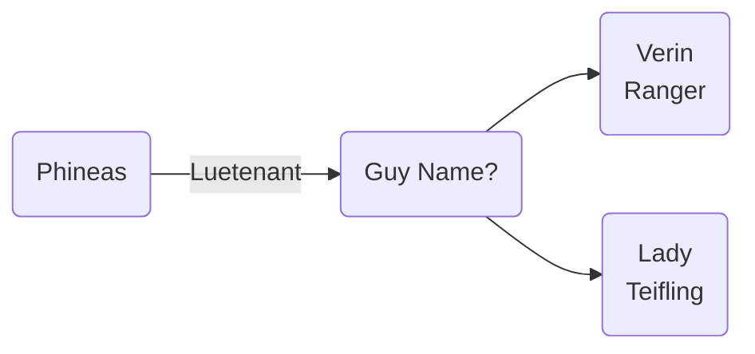

# Stormreach
[https://eberron.fandom.com/wiki/Stormreach](https://eberron.fandom.com/wiki/Stormreach)

Stormreach is a small frontier city nestled on the eastern coast of the Skyfall Peninsula in Xen'drik. Despite its small population, Stormreach is an important city because of its location, allowing easy docking access to travelers wishing to enter Xen'drik. The city also acts as a center for trade and commerce for all who visit the lost continent of Xen'drik. Stormreach is known by some as the "City of Dungeons" because it was built atop an ancient city from the long-lost civilization of giants. 

## Associations

