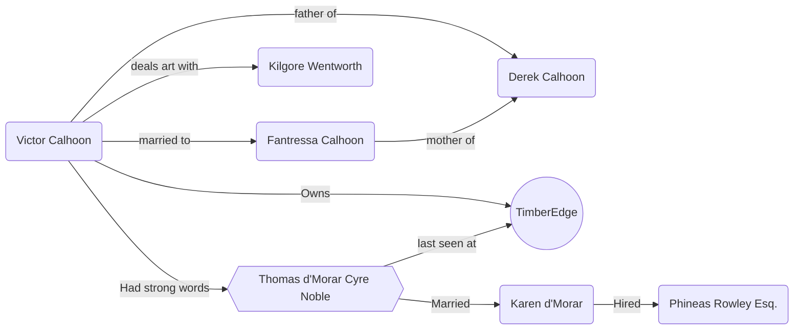
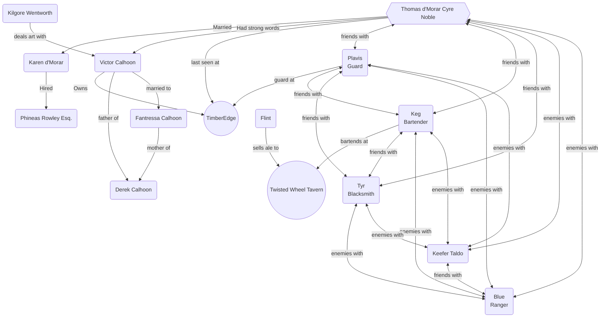

# Zilspar

[https://eberron.fandom.com/wiki/Zilspar](https://eberron.fandom.com/wiki/Zilspar)

Zilspar is a town east of Sharn.  It is a trade stop on the way towards the nation of Zilargo. Additionally, Zilspar is a village in the south of Breland. 

It lies east of Sharn on the Orien trade road to Trolanport, on the southern edge of the King's Forest and near the coast of the Thunder Sea. It has been represented by Thanoc, an elected lawmaker, for nearly twelve years.

## Notable NPCs

- Kilgore Wentworth - Eclectic art dealer who needed an escort to the TimberEdge Estate
- Victor Calhoon - Lord of the TimberEdge estate - not of noble blood but has pulled his way up with money through arms dealing during the war.
- Thomas d'Morar - Wife, Karen, hired Phineas to find him.   He is a noble in Sharn.  His family is one of the architects of many of the buildings
- Star Hound - Air ship piloted by Charles "Chuck" d'Lyrandar 
- Winfry - owner of the general store
- Keefer Taldo -
- Blue  - Ranger, met party at 
- Plavis - Guard at the TimberEdge Estate 
- Keg - Bartender
- Flint - Sells ale to taverns and inns.  Has apiary near woods

## Wherewolfs and WhereBoars? There Boars!

The group in search of Thomas are engulfed in a battle between two viral clans, the wearwolfs and wearboars!

Including Blue, a ranger disliked by many, but he held a special place in the hearts of our heros.

Sandly Blue, a wereboar, was murdered durring a vicious battle between his pack and a rival pack of warewolfs.

Lyria specifically took Blue's death personally.  In an attempt to ease the fighting, she cast a hypnotying spell capturing Blue in her gause.

The nearby werewolfs unaffected took advantage of Blues situation ultimately landing a critical blow ending his life.

```mermaid
flowchart LR;
    z((Zilspar)) --> Wereboars;
    z --> Werewolfs;
		z --> Werebears;
    subgraph Werewolfs;
    plavis(Plavis the Guard);
    tyr(Tyr the Blacksmith); 
    keg(Keg the Bartender);
    thomas{{Thomas d'Morar Cyre Noble}};
		alpha("&#10026; Alpha Werewolf");
    end;
    subgraph Wereboars;
    blue("#9760; Blue the Ranger");
    keefer(Keefer Taldo);
    teller("&#10026; Teller");
    end;
    subgraph Werebears;
    mondue("&#10026; Mondue");
    end;
		s("&#10026; Indicates the OG beast")
		Werewolfs --> |Lead By| durid{{Corrupt Druid}}
```

## Victors Relationships

A powerful figure in Zipspar, the team learns some interesting facts about the boastful excentric

## The Zilspar Spider Web

