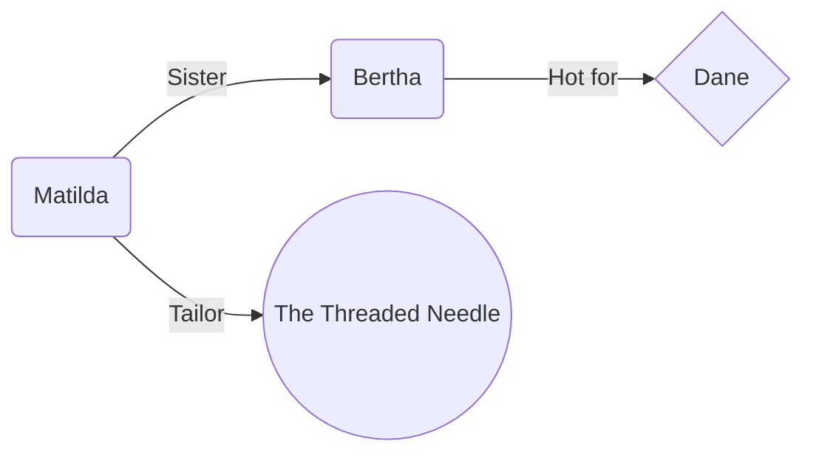

# Background

## Sharn Relations

```mermaid
flowchart LR;
    bertha(Bertha) --> |Hot for| dane{Dane};
    matilda(Matilda) --> |Sister| bertha;
    matilda --> |Tailor| needle((The Threaded Needle));
```
