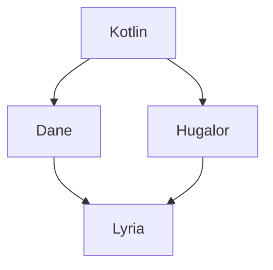
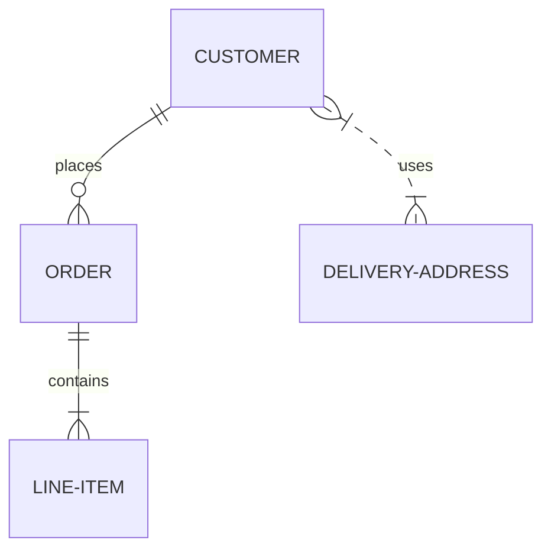
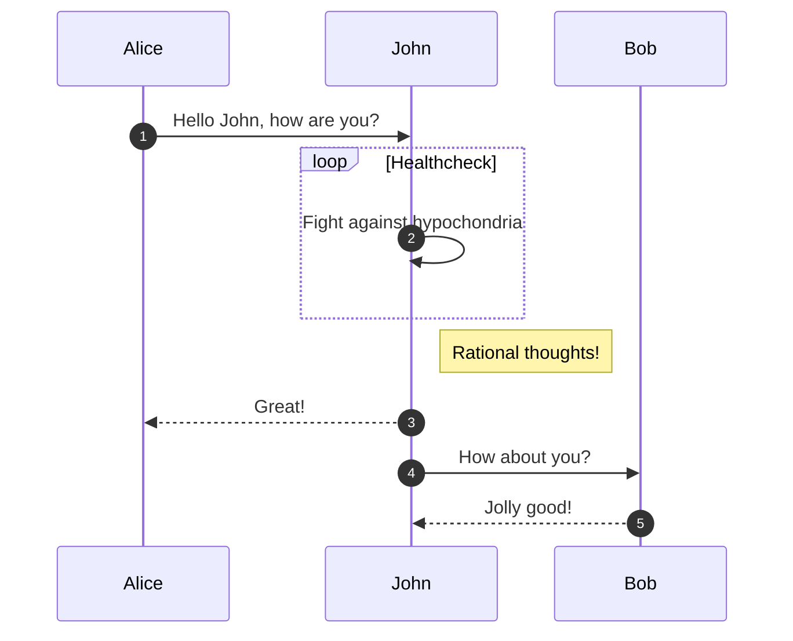

# background

_im working on it i promise_

but checkout that mermaid flowchart!

## Associations

```mermaid
graph TD;
    Kotlin-->Dane;
    Kotlin-->Hugalor;
    Dane-->Lyria;
    Hugalor-->Lyria;
```

```mermaid
erDiagram
    CUSTOMER ||--o{ ORDER : places
    ORDER ||--|{ LINE-ITEM : contains
    CUSTOMER }|..|{ DELIVERY-ADDRESS : uses
```

```mermaid
sequenceDiagram
    autonumber;
    Alice->>John: Hello John, how are you?;
    loop Healthcheck;
        John->>John: Fight against hypochondria;
    end;
    Note right of John: Rational thoughts!;
    John-->>Alice: Great!;
    John->>Bob: How about you?;
    Bob-->>John: Jolly good!;
```
