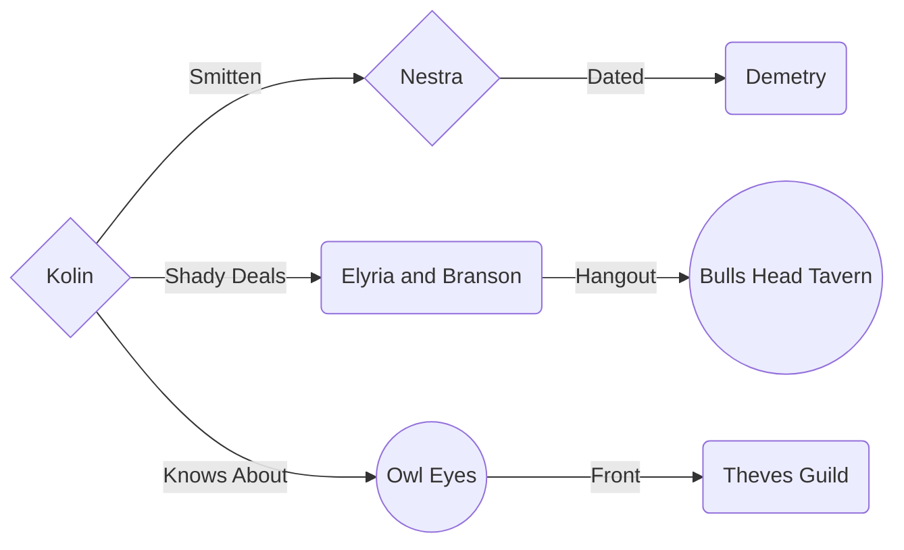

# Background

_im working on it i promise_
    
## Shopping list

| Item | Cost | Reason |
| --- | --- | --- |
| Chalk | 0.01 gp  | All kinds of stuff |
| 3 Pitons | 0.05 gp | Climbing stuff  |
| Candles | 0.01 gp  | Molds and stuff  |
| Scroll Case | 1.00 gp  | Molds and stuff  |
| Block and Tackle | 1.00 gp | Lifting / Dragging stuff |
| Flour | ?? | Detect and blowup stuff |
| String | ?? | Tying stuff up |
| Signal Whistle | 0.05 gp  | Alerting team (enemies) |
| Caltrops | 0.05 gp | Spiky things on the ground |
| Bell | 1.00 gp  | Sound stuff (with string) |
| Sand | ?? | Sound stuff (with string) |
| Healers Kit | 5.00 gp | heal people |
| Mirror | 0.50 gp | see stuff |
| Oil Flask | 0.10 gp | slippery stuff |
| Sack | 0.01 gp | brown sack for stuff |
| Sealing Wax | 0.50 gp  | copy keys and seals and stuff |
| Wet stone | ?? | cleaning stuff |
  
## Sharn Relations

