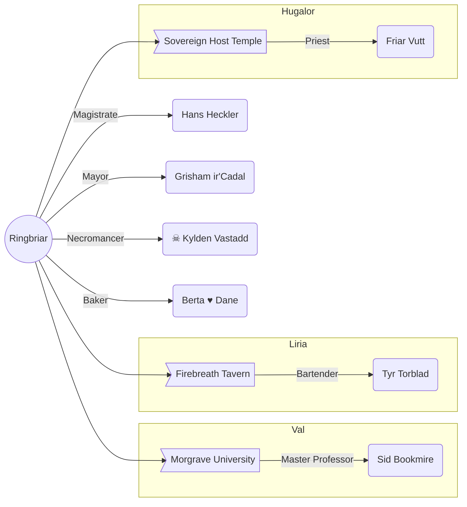

# Ringbriar

A small town west of the Dagger River in Breland. The town is known for its timber industry though it has been going through a rough patch since the War.

The Skyraker forest to the north still holds many copses of soar wood, one of the primary needs for building airships.

A Dhakaani ruin is often filled with researchers from Morgrave University. Otherwise, the town hosts soldiers or diplomats on their way to Droaam, the next nation to the west, inhabited by monsters.

## Associations

